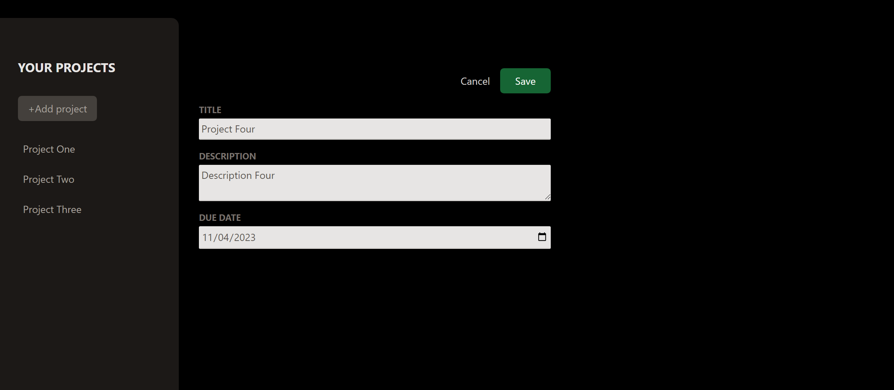

  <h2>Project manager app</h2>

Create/delete a project. Add title, description and tasks. 
Save it and create another one or more, they are all stored in your sidebar.
 
PS: The purpose of this repository is to exercise state, refs, data flow between components and identifying the problem of props drilling in React.js. The site is not fully responsive and there is not much styling.

Technologies used: React.js, Tailwind css.

Open this link [https://project-manager-andrei-alexandrov.netlify.app/](https://project-manager-andrei-alexandrov.netlify.app/) to view it.

## Game image

## Available Scripts

Open the project directory where you can type (using Git Bash):

### `npm install`
### `npm run dev`

Open this link [http://http://localhost:5173](http://http://localhost:5173) to view it in your browser.

